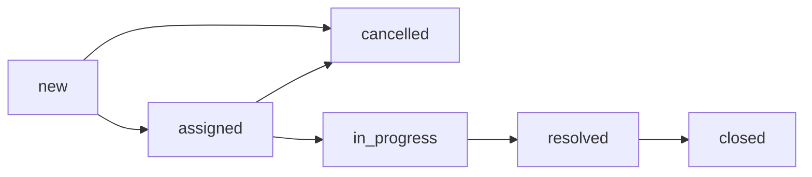

# Support Ticket SLA Processing System

Backend project for **Phase 2 - Week 6: REST API & Database Integration**.

This repository includes a robust Support Ticket SLA Processing System featuring Domain Models, Status Validation, High-Performance Concurrency, PostgreSQL integration, and REST API endpoints. You can run the entire stack (App + Database) using Docker Compose.

## Week 6 Scope

Implemented:

- **REST API Endpoints:** Complete API suite using Gin framework (`POST /api/v1/tickets`, `GET /api/v1/tickets`, `GET /api/v1/tickets/:id`, `PATCH /api/v1/tickets/:id/status`, `POST /api/v1/ticket-events/import`, `GET /api/v1/reports/daily`).
- **Database Integration:** PostgreSQL schema, migrations, and data access using the Repository pattern with GORM.
- **Core Domain Logic:** Ticket domain structs for `tickets`, `ticket_events`, and `ticket_reports`. Strict status validation and FSM transition rules.
- **High-Performance Concurrency:** Lock-free batch event import service utilizing a worker pool. Efficiently groups events by `TicketID` to eliminate N+1 database queries and Mutex bottlenecks.
- **Reporting System:** Daily SLA report generation logic (New, Resolved, Cancelled, Overdue, SLA Breaches).
- **Clean Architecture:** Strict separation between Handlers, Services, Repositories, and Domain models.

Not implemented yet:

- Automated unit or integration test coverage.
- Scheduled cron jobs for reports.

## Business Context

The system models internal support tickets for IT, HR, or facilities requests. Ticket events are imported in high-volume batches and must be validated. The system generates Service Level Agreement (SLA) reports to track agent resolution performance.

## Status Flow

Allowed status transitions are defined in `internal/domain/ticket.go`:




Notes:

- Valid statuses: `new`, `assigned`, `in_progress`, `resolved`, `closed`, `cancelled`.
- Valid priorities: `low`, `medium`, `high`.
- Terminal statuses do not transition further because `closed` and `cancelled` have no outgoing transitions.

## Project Structure

```text
support-ticket-sla/
├── cmd/
│   ├── api/
│   │   └── main.go                  # Starts Gin server: loads config, connects to DB, setups router
│   ├── import-sample/
│   │   └── main.go                  # Runs test batch import with sample data (Week 5)
│   └── report/
│       └── main.go                  # ETL job: go run ./cmd/report --date=2026-05-04 (Week 8)
│
├── docs/
│   └── swagger.yml                  # Swagger UI for API documentation
├── internal/
|   ├── app/
│   │   ├── app.go                       # main.go for the application
│   ├── auth/
│   │   ├── context.go                   # checks Authorization Bearer 
│   │   ├── keycloak.go                  # Verifies JWT with Keycloak JWKS endpoint
│   │   └── claims.go                    # Struct containing user info from JWT claims
│   │
│   ├── config/
│   │   └── config.go                # Loads environment variables: DB URL, port
│   │
│   ├── domain/
│   │   ├── ticket.go                # Ticket struct, TicketStatus enum, Priority enum, transition validator
│   │   ├── ticket_event.go          # TicketEvent struct, BatchImportResult struct
│   │   ├── ticket_report.go         # DailyTicketReport struct
│   │   └── errors.go                # Sentinel errors: ErrInvalidTransition, ErrValidation
│   │
|   ├──dto/
|   |   ├── api_response.go          # API response structure
|   │   ├── pagination.go            # Pagination structure
│   │   └── ticket_dto.go            # Ticket DTOs
│   |   └── ticket_event_import_response.go # Ticket event import response structure
|   |   
|   ├── errmsgs/
│   |   ├── errors.go                # Error messages
|   |
|   ├── handler/
│   │   ├── ticket_handler.go        # POST /tickets, GET /tickets, GET /tickets/:id,... 
│   │   ├── import_handler.go        # POST /ticket-events/import
│   │   └── report_handler.go        # GET /reports/daily
│   │
|   ├── middleware/
|   |
|   ├── migration/
|   |   └── migrate.go               # Uses GORM to initialize database schemas
|   |
│   ├── repository/
│   │   ├── ticket_repository.go     # Interface + Postgres impl: Create, GetByID, List, UpdateStatus
│   │   ├── event_repository.go      # Interface + Postgres impl: Save, ListByTicketID
│   │   └── report_repository.go     # Interface + Postgres impl: Upsert, GetByDate
│   │
|   ├── router/
|   |   └── router.go                # Initializes routes and groups
│   ├── service/
│   │   ├── ticket_service.go        # Interface + impl: Create, GetByID, List
│   │   ├── import_service.go        # Interface + impl: Coordinates batch import, calls
│   │   └── report_service.go        # Interface + impl: Generate daily report, GetByDate
│   │
│   └── worker/
│       ├── job.go                   # Worker processing pool  
│
├── .github/
│   └── workflows/
│       └── ci.yml                   # on push: go fmt, go vet, go test -race ./...
│
├── docker-compose.yml               # Services: app + postgres + keycloak
├── Dockerfile                       # Multi-stage build for Go API
├── Makefile                         # make run, make test, make migrate, make docker
├── .env.example                     # Environment variables template, do not commit real .env
├── .gitignore
├── go.mod
├── go.sum
└── README.md
```


### Running Locally

Prerequisite:
- Go `1.22+` installed.
- A running PostgreSQL database.

1. Create a `.env` file based on your local database credentials:
   ```env
   DB_HOST=localhost
   DB_PORT=5432
   DB_USER=postgres
   DB_PASSWORD=secret
   DB_NAME=ticket_sla
   DB_SSLMODE=disable
   SERVER_PORT=8080
   WORKER_POOL_SIZE=20
   MAX_BATCH_SIZE=5000
   ```
2. Run the API Server:
   ```bash
   go run ./cmd/api/main.go
   ```

### Running Reports

You can generate a daily SLA report manually via the CLI tool:
```bash
go run ./cmd/report/main.go --date=2026-05-15
```

## Roadmap

- **Week 7:** Add table-driven unit tests, integration tests, consistent error responses, and CI.
- **Week 8:** Add scheduled daily report ETL job, report API, README polish, and final demo flow.
