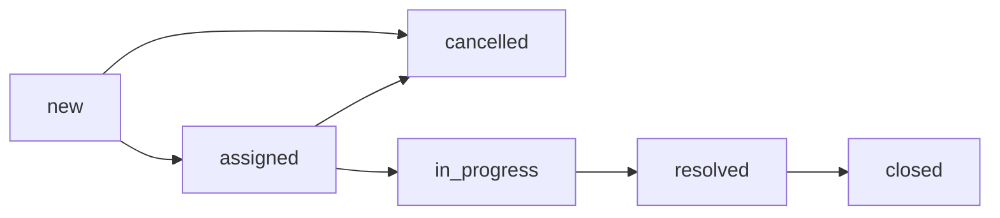
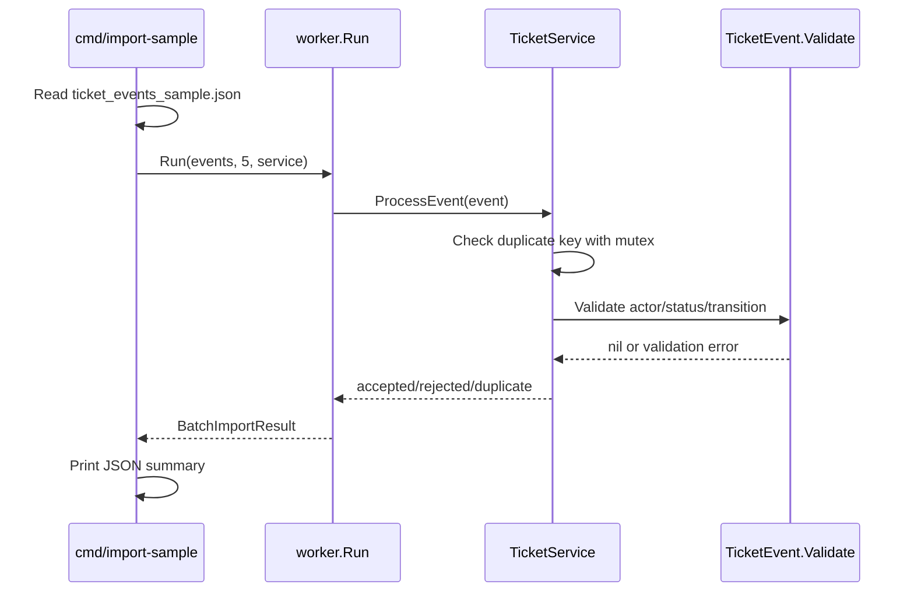

# Support Ticket SLA Processing System

Backend project for **Phase 2 - Week 5: Core Logic & Concurrency**.

This repository currently focuses on in-memory Go logic: domain models, status validation, batch ticket-event processing, and a goroutine worker pool. REST API, PostgreSQL, Docker Compose runtime, CI, and ETL reporting are planned for later weeks and are not claimed as implemented here.

## Week 5 Scope

Implemented:

- Ticket domain structs for `tickets`, `ticket_events`, and `daily_ticket_reports`.
- Status and priority validation.
- Ticket status transition rules.
- In-memory batch import service.
- Concurrent worker pool using goroutines, channels, and `sync.WaitGroup`.
- Duplicate counting with a mutex-protected in-memory map.
- Sample importer command: `go run ./cmd/import-sample`.

Not implemented yet:

- REST endpoints such as `POST /tickets` or `POST /ticket-events/import`.
- PostgreSQL schema, migrations, repositories, or persistence.
- Docker Compose app/database runtime.
- Automated unit or integration test coverage.
- Daily ETL/report generation command.

## Business Context

The system models internal support tickets for IT, HR, or facilities requests. Ticket events are imported in batches and must be classified as:

- `accepted`: valid event and not previously seen.
- `rejected`: invalid actor, status, or transition.
- `duplicate`: event key was already processed in the current in-memory run.

The Week 5 target is to prove the core business rules and concurrency flow before adding API and database layers.

## Status Flow

Allowed status transitions are defined in `internal/domain/ticket.go`:



Notes:

- Valid statuses: `new`, `assigned`, `in_progress`, `resolved`, `closed`, `cancelled`.
- Valid priorities: `low`, `medium`, `high`.
- Same-status events such as `new -> new` are accepted by `TicketEvent.Validate()` and are useful for creation/history records.
- Terminal statuses do not transition further because `closed` and `cancelled` have no outgoing transitions.

## Project Structure

```text
.
|-- cmd/import-sample/
|   |-- main.go                    # Loads sample JSON and runs the worker pool
|   `-- ticket_events_sample.json  # Mock batch input for Week 5
|-- internal/domain/
|   |-- ticket.go                  # Ticket model, status/priority rules
|   |-- ticket_event.go            # Ticket event model and event validation
|   |-- ticket_report.go           # Daily report model and validation
|   `-- errors.go
|-- internal/service/
|   `-- ticket_service.go          # In-memory event processing and duplicate detection
|-- internal/worker/
|   `-- job.go                     # Worker pool for batch processing
|-- config/
|   `-- config.go                  # Placeholder package
|-- Dockerfile                     # Placeholder for later weeks
|-- docker-compose.yml             # Placeholder for later weeks
`-- go.mod
```

## Processing Flow



Current duplicate key:

```text
ticket_id|from_status|to_status
```

Duplicate detection happens before validation in `TicketService.ProcessEvent()`. Because of that order, an invalid event that repeats an existing key is counted as `duplicate`, not `rejected`.

## How To Run

Prerequisite:

- Go version compatible with `go.mod` (`go 1.26.2` is currently declared).

Run the sample importer:

```bash
go run ./cmd/import-sample
```

Current output from the included sample file:

```json
{
  "accepted_count": 425,
  "rejected_count": 5,
  "duplicate_count": 1
}
```

Run package checks:

```bash
go test ./...
```

Current result: all packages compile, but there are no test files yet.

## Sample Input

The sample batch is stored at:

```text
cmd/import-sample/ticket_events_sample.json
```

Each event uses fields like:

```json
{
  "ticket_id": 1,
  "note": "Ticket assigned to support agent",
  "from_status": "new",
  "to_status": "assigned",
  "actor_id": "agent-002",
  "created_at": "2026-05-05T16:59:49.129094074+07:00"
}
```

The current sample contains 431 events, including validation cases for blank actor, unknown statuses, illegal transitions, and terminal-state transitions.

## Current Limitations

- Processing is in-memory only; results are not persisted.
- The service does not load or update the full ticket state across events.
- Event order is not enforced by `created_at`.
- Duplicate detection does not use `event_id`; the sample data currently omits `event_id`.
- Worker errors are collapsed into result counts; error details are not returned by the batch summary.
- `TicketReport` exists as a domain model, but no ETL job calculates or stores reports yet.

## Roadmap

- **Week 6:** Add REST API, PostgreSQL schema/migrations, repository layer, and Docker Compose app/database setup.
- **Week 7:** Add table-driven unit tests, integration tests, consistent error responses, and CI.
- **Week 8:** Add daily report ETL job, report API, README polish, and final demo flow.
